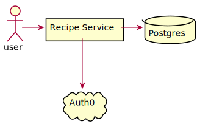
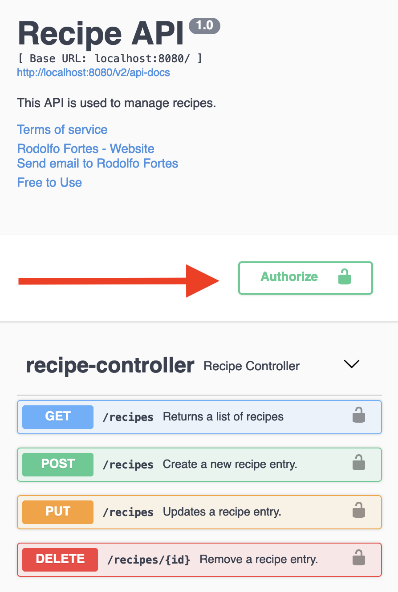

# About
This is code assigment used by ABN AMRO as part of hire candidates assessment process.

<details>

<summary>Click here for problem description</summary>

## Objective

Create a web application which allows users to manage your favourite recipes.

Create API’s to show all available recipes and the actions to create, update and delete a recipe.

API’s could be able to retrieve recipes with following attributes:

1. Date and time of creation (formatted as dd‐MM‐yyyy HH:mm).
2. Indicator if the dish is vegetarian.
3. Indicator displaying the number of people the dish is suitable for.
4. Display ingredients as a list.
5. Cooking instructions.

### Requirements
Please ensure that we have some documentation about the architectural choices and also how to
run the application.

The project is expected to be delivered as a GitHub repository URL or a zip file.

All these requirements needs to be satisfied:
1. Application must be production ready.
2. REST application must be implemented using Java.
3. Data must be persisted in a database.
4. Use any frameworks of your choice for REST.
5. Unit testing must be taken in due consideration.
6. Describe at least 10 testing scenarios using GivenWhenThen style.
7. The API's must be built ensuring that it is secured from security attacks.

### Bonus
1. REST application should be secured by implementing authentication process (please provide
   credentials).
2. Application should have an API documentation.
3. Write automation tests for the described testing scenarios.
4. Use of container based solutions is an added advantage.
5. Creating a single-page application illustrating the use of API.

</details>

## Solution



This project consists of a Spring Boot Application that is used to handle requests to
manage recipes, Auth0 is used for authentication and Postgres as the DBMS (see overview diagram above).

## How to run it
This project uses docker-compose, to run it git clone the project and in its directory and run:

```docker-compose -f src/main/docker/docker-compose.yml up```

To test the APIs, with the application running go to http://localhost:8080/swagger-ui/#/recipe-controller/

As this application uses auth0 to authentication, in order to test the APIs using this interface you **must 
provide an authentication token**.

<details>
<summary>Click here to check how to set the authentication header</summary>



</details>

## APIs Description
Note that all APIs requires an Authorization Token that should be provided in the request header.

### Create Recipes

```
curl --request POST 'http://localhost:8080/recipe' \
--header 'Authorization: Bearer token' \
--data-raw '{
"name": "my recipe name",
"vegetarian": false,
"ingredientsQuantity" : {"ingredient01": 5, "ingredient02":1},
"servingSize": 1,
"cookingInstructions": "instructions go here"
}'
```

### Retrieve Recipes

```
curl --request GET 'http://localhost:8080/recipes' \
--header 'Authorization: Bearer token'
```

### Update Recipes

The id of the recipe that we want to update must be specified in
 the id field in the request body.

```
curl --request UPDATE 'http://localhost:8080/recipe' \
--header 'Authorization: Bearer token' \
--data-raw '{
"id": 1,
"name": "my new recipe name",
"vegetarian": false,
"ingredientsQuantity" : {"ingredient01": 5, "ingredient02":1},
"servingSize": 1,
"cookingInstructions": "new instructions go here"
}'
```

### Delete Recipes

We must pass the id of the recipe that we want to delete as a path parameter.

```
curl --request DELETE 'http://localhost:8080/recipes/1' \
--header 'Authorization: Bearer token'
```
## Docker deployment
This application makes use of the JIB plugin, more information can be found here:
https://github.com/GoogleContainerTools/jib

In order to update its image we need to run the following command:

```
./gradlew jib --image=rfortes/recipes
```

Note that proper Docker Hub authentication is required in order to do it.